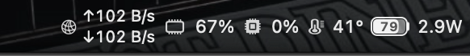
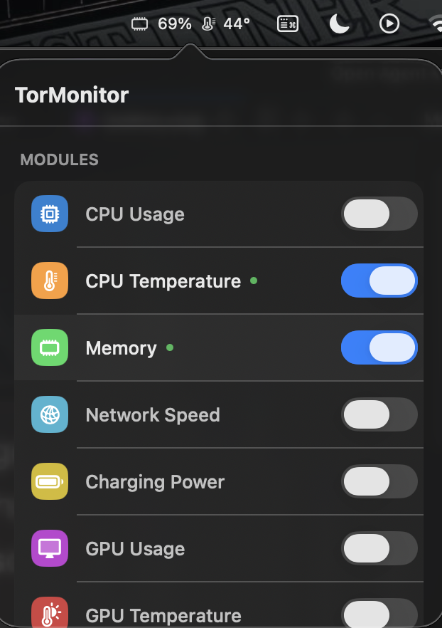
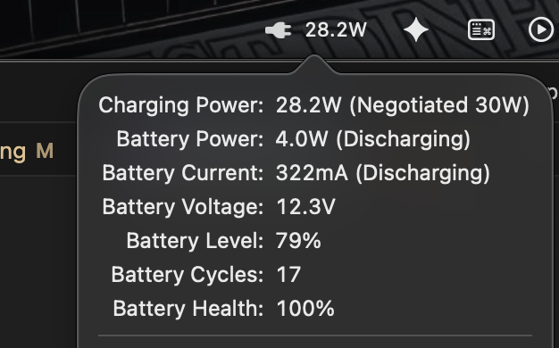

# TorMonitor `v2.0.0`

A lightweight, premium macOS menu bar system monitor. All metrics are combined into a single status bar item with minimal resource usage and a modern glassmorphism aesthetic.

   

---

## 🚀 What's New in v2.0.0

- **Modern Glassmorphism UI** — Completely redesigned Settings popover with a premium macOS Sonoma/Sequoia aesthetic using `.ultraThinMaterial`.
- **Advanced Memory Optimization** — RAM footprint reduced to ~25-35MB via transient IOKit connections and Equatable View caching.
- **Apple Silicon Native** — Accurate CPU temperature readings for M1, M2, M3, M4, and M5 chips using averaged core sensor data.
- **Dynamic Hardware Detection** — Automatically hides GPU and Fan metrics on fanless or GPU-less devices (like MacBook Air).


## Download

You can download the latest version of TorMonitor as a `.dmg` file from the [Releases](https://github.com/luewire/TorMonitor/releases) page. The full source code is available here on GitHub.

---

## Screenshots

**Menu Bar**



**Settings Panel**



**Battery Detail**



---

## Features

- **Ultra Lightweight** — Uses less than **35MB of RAM** (idle) thanks to custom SwiftUI view caching and zero persistent IOKit leaks.
- **Premium Design** — Smooth spring animations, custom pill-segmented controls, and hover highlights.

- **CPU Usage** — Real-time percentage display via `host_processor_info`
- **CPU Temperature** — Read from SMC (no root required)
- **Memory** — Used / Total with percentage; hover for quick details
- **Network Speed** — Upload & download in compact format with auto unit conversion
- **GPU Usage** — Supports multiple GPUs (integrated & discrete); shows max utilization in menu bar
- **GPU Temperature** — Read from IOAccelerator + SMC fallback
- **Battery / Charging Power** — Real-time adapter wattage; hover for battery health details

---

## Interactions

| Action | Result |
|---|---|
| **Hover** over any segment | Shows a simple inline tooltip (e.g. `Memory: 5.2GB/16.0GB (33%)`) |
| **Single click** on CPU/CPU Temp | Opens Activity Monitor → CPU tab |
| **Single click** on Memory | Opens Activity Monitor → Memory tab |
| **Single click** on Battery | Opens Activity Monitor → Energy tab |
| **Single click** on Network | Opens Activity Monitor → Network tab |
| **Two-finger tap (right-click)** | Opens / closes the Settings popover |

---

## Settings

- Toggle each module on/off — disabled modules are **not polled** and don't consume RAM
- Adjust refresh interval: **3s / 5s / 10s**
- Launch at Login toggle (via SMAppService)

---

## Requirements

- macOS 13.0+
- Intel (x86_64) or Apple Silicon (arm64)
- Xcode (for building from source)

---

## Build from Source

```bash
git clone https://github.com/luewire/tormonitor.git
cd tormonitor
xcodebuild -project TorMonitor.xcodeproj -scheme TorMonitor build
```

---

## Project Structure

```
TorMonitor/
├── App/
│   └── TorMonitorApp.swift            # App entry point
├── Core/
│   ├── StatusBarController.swift      # Menu bar rendering & interaction
│   ├── MonitorManager.swift           # Data polling & refresh scheduling
│   ├── CPUService.swift               # CPU usage
│   ├── MemoryService.swift            # Memory stats
│   ├── NetworkService.swift           # Network speed
│   ├── BatteryService.swift           # Battery & charging power
│   ├── GPUService.swift               # GPU usage & temperature
│   ├── SMCService.swift               # SMC reads (transient connections)
│   ├── SensorDetector.swift           # Hardware-specific auto-detection
│   ├── Localization.swift             # Localized string definitions
│   ├── LaunchAtLoginService.swift     # Launch at login
│   └── Toggles/                       # Individual module toggle states
├── Views/
│   ├── DesignTokens.swift             # Centralized UI tokens (colors, radii)
│   ├── ModuleRowView.swift            # Equatable row components
│   ├── PillSegmentedControl.swift     # Custom animated picker
│   ├── SettingsView.swift             # Modern Settings popover UI
│   └── PopoverView.swift              # Popover container
├── Resources/
│   └── Info.plist
└── Assets.xcassets/
```

---

## Data Sources

| Metric | Source |
|---|---|
| CPU Usage | `host_processor_info` |
| CPU Temperature | IOKit SMC (M1-M5 core averaged keys) |
| Memory | `host_statistics64` |
| Network Speed | `sysctl NET_RT_IFLIST2` |
| Charging Power | IOKit `AppleSmartBattery` + SMC `PDTR` |
| GPU Usage | IOKit IOAccelerator `PerformanceStatistics` |
| GPU Temperature | IOAccelerator `Temperature(C)` + SMC fallback |
| Process Info | `libproc` (`proc_pidinfo`) |
| IP Geo Lookup | ip2region offline database |

---

## License

Copyright © 2025 luewire

Permission is hereby granted, free of charge, to any person to use, copy, modify, merge, and distribute this software freely, without restriction.

This software is provided "as is", without warranty of any kind.
